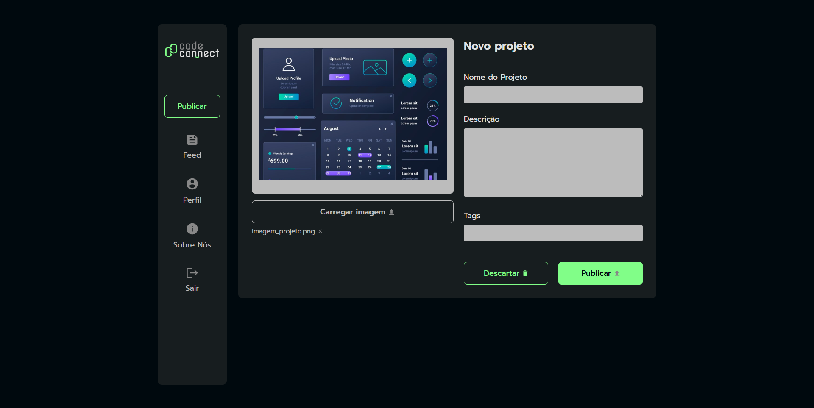

# 📸 CodeConnect
CodeConnect é uma página web desenvolvida com o objetivo de permitir o upload de imagens de forma simples e interativa. O projeto foca principalmente na utilização de JavaScript moderno, com ênfase em Promises e async/await, garantindo uma experiência assíncrona e fluida para o usuário.

## 🚀 Funcionalidades
- Upload de imagens através da interface web.

- Manipulação assíncrona dos dados com async/await.

- Feedback ao usuário durante o processo de envio.

🛠 Tecnologias Utilizadas
- **HTML5** – Estrutura da página.

- **CSS3** – Estilização e responsividade.

- **JavaScript** (ES6+) – Lógica principal com foco em:
  - Promises
  - Async/Await
 
## 💡 Objetivo do Projeto
Este projeto foi desenvolvido com fins de aprendizado, especialmente para consolidar conceitos de JavaScript moderno, como **manipulação de promessas** e o uso de **async/await** para operações assíncronas, com um exemplo prático e visual.
